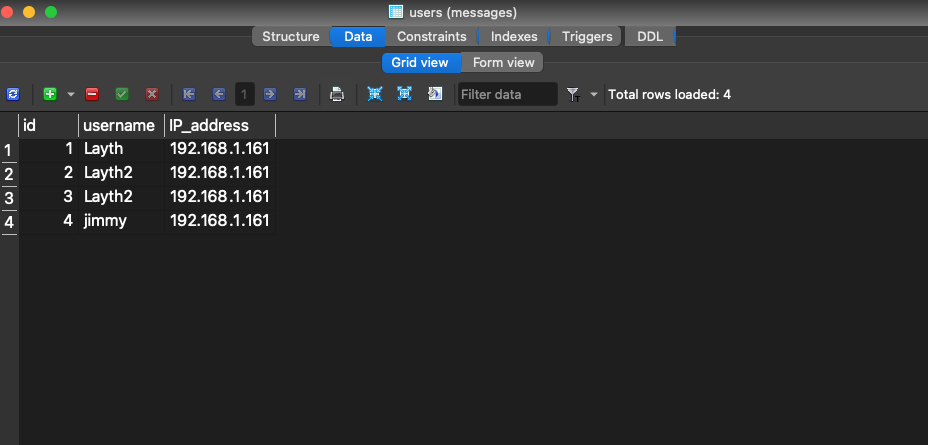

# P2P-Chat-System

## Overview

This is a peer to peer chat system that allows clients to message one another without the need of connecting to a centralized server. There is no centralized server at all involved in this implementation. Instead, the system works by allowing a client to become a "temporary server" allowing other clients to connect to them for chatting purposes. This system has two databases that are stored for each client. One database called messages tracks the messaging history of the user while another database called Users tracks the current users contact list. This implementation allows for user discovery as well as message synchornization.

## Requirements

-socket

-threading

-sqlalchemy

## Installation Guide Lines

Install p2pFinal.py and messageDb.py and put them into the same directory. To run the system write this in the command line :

```python
python p2pFinal.py
```

## How it works

### 1. Logging In

After running the above code in the command line you will be prompted with 2 options either to login(A) or to Create an account(B). If this is your first time running the code then you should proceed with option B and create an account in the database(which is just your name in this instance). 

### 2. Adding friend to contact list

After creating an account or logging into an existing one, you will be shown your current contact list of people you have added as friends. You will then be prompted with 2 options to either add a user(A) or to connect to a user(B). If you want to add a user to your contact list then you proceed with option A and it will ask you for the users IP address that youd like to add. 

### 3. Connect to friend already in contact list

If you are trying to connect to a user then you proceed with option B which will then ask you for the username of the user you are trying to connect to. If you friend is online then it will connect to them and allow for messaging. If the friend is not online it will give you the option to start a session. This allows the other user to join your session. 

### 4. Offline Messaging(Message Synchornization)

If you have started a session and the other user is not currently online then you can still send the messages to the other user and it will be sent to them the next time you guys are in a session together. 

## Databases 

Screenshot showing the user Database:




